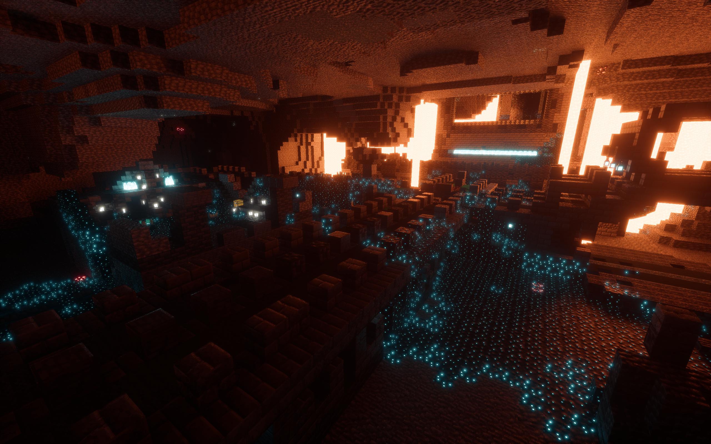
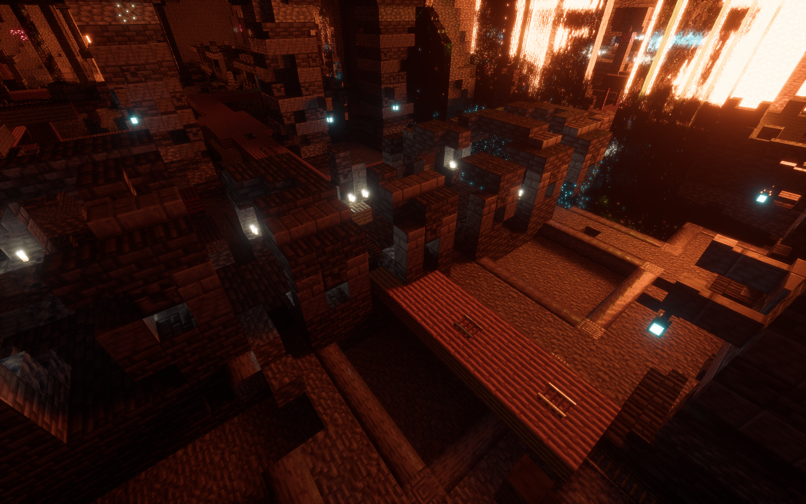
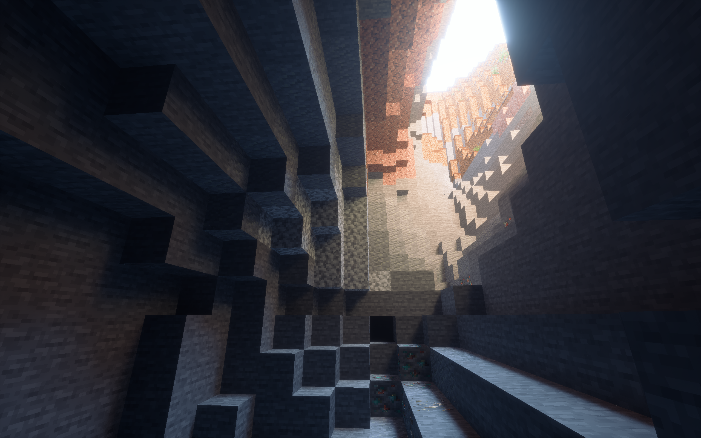

# Dirt RT

A simple path tracing shader for vulkanite mod,which uses Nvidia GPU's RT cores to render

**WARNING: You need a LabPBR resourcepack to use this shader pack properly. IF you reload your resourcepack, you need to RESTART the game to make the shader work properly.**

**This pack needs this version of [Vulkanite](https://github.com/sjrsjz/vulkanite-modified/tree/26.2)**, you may build the latest version by yourself.

**Technical documentation:** [ZH](doc/tech.pdf) | [EN](doc/tech_en.pdf)

# Screenshots

